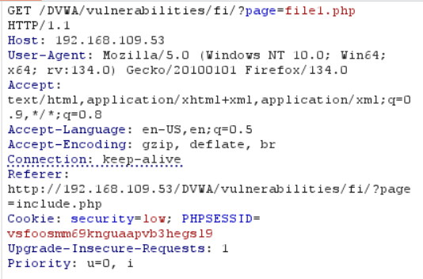

# File Inclusion

## Security Level - Low


## Source Code

```php
 <?php

// The page we wish to display
$file = $_GET[ 'page' ];

?>
```
If we choose one of the files: 



### Local File Inclusion

**Request**:


**Browser**:


### Remote File Inclusion


