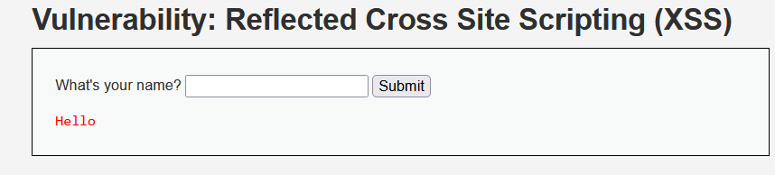
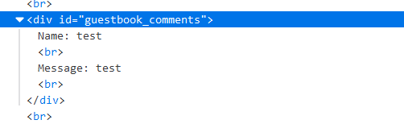

# XSS

## Security Level - Low

### DOM-Based XSS
Choose English language and intercept the request in Burp.

Notice that the choice is being passed to the `document.write()` sink

#### Exploit
Exploiting this requires escaping `<option value='English'>English</option>`. 

Submit `domain/DVWA/vulnerabilities/xss_d/?default='>`

#### Result

### Reflected XSS

In order to exploit this, we add a random value, submit it and then check the page source:

We notice that the value is reflected between `<pre></pre>` tags.

We can now submit ``.

#### Result

### Stored XSS

Input a random value to the `Name` and `Message` fields and check how the values are stored.

For this stored XSS to work, we can try to add `` in the message box.

#### Result
